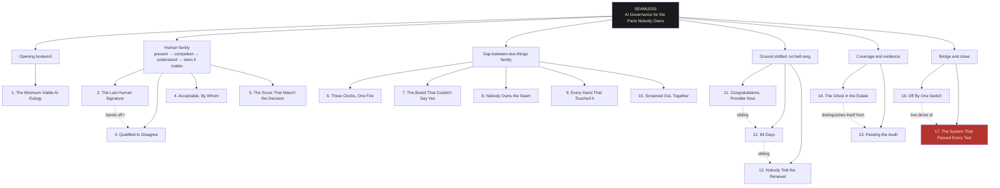

# Rosetta Stone: Finding the Right Chapter Fast

Three ways into this book: by symptom (what's actually going wrong), by regulation (what you're trying to comply with), or by family (how the essays relate to each other). This page is all three.

## By symptom — start here if you have a real problem right now

| If you're facing... | Read essay | Then use chapter |
|---|---|---|
| A system is being retired and nobody's said how | 1. The Minimum Viable AI Eulogy | Ch.1 Decommission Record |
| Someone signed off and you're not sure it meant anything | 2. The Last Human Signature | Ch.2 Human Participation Tiers |
| A reviewer missed something they should have caught | 3. Qualified to Disagree | Ch.3 Reviewer Competence |
| Staff are using AI tools and no one's said what's allowed | 4. Acceptable, By Whom | Ch.4 AUP Tiers |
| An automated score is quietly driving real decisions about people | 5. The Score That Wasn't the Decision | Ch.5 Draws Strongly Test |
| An incident just happened and you don't know which deadline governs | 6. Three Clocks, One Fire | Ch.6 Merged Clock Table |
| Something needs a decision faster than your approval process can move | 7. The Board That Couldn't Say Yes Fast Enough | Ch.7 Authority Ladder |
| Two systems, or two teams, touch and neither owns the join | 8. Nobody Owns the Seam | Ch.8 Seam Inventory |
| AI-generated content is leaving your org and you don't know if the label survives | 9. Every Hand That Touched It | Ch.9 Label Chain of Custody |
| You use a vendor's AI to screen people and can't see the pattern across your own decisions | 10. Screened Out, Together | Ch.10 Bias Allocation |
| You've modified or rebranded someone else's AI model | 11. Congratulations, You're a Provider Now | Ch.11 Provider Status Check |
| You depend on an AI vendor that could vanish | 12. 84 Days | Ch.12 Vendor Continuity Register |
| You assumed your insurance covers AI risk | 13. Nobody Told the Renewal | Ch.13 Coverage Check |
| You suspect there are AI tools in use that nobody's counted | 14. The Ghost in the Estate | Ch.14 Finding the Ghosts |
| You need to prove your AI inventory is real, not just on paper | 15. Passing the Audit You Haven't Been Given Yet | Its own embedded AI Inventory Template *(see note)* |
| You're about to disable a safety control for a good reason | 16. Off By One Switch | Ch.15 Switch Map |
| Every control passed and something still went wrong | 17. The System That Passed Every Test | Ch.16 Reading the System |

## By regulation — start here if you're solving for a specific requirement

| Regulation / standard | Essays that touch it |
|---|---|
| AI Act, Art. 4 (AI literacy) | 4. Acceptable, By Whom |
| AI Act, Art. 14/26 (human oversight) | 2. Signature · 3. Qualified to Disagree |
| AI Act, Art. 25 (provider reclassification) | 11. Provider Now |
| AI Act, Art. 50 (content transparency) | 9. Every Hand That Touched It |
| AI Act, Art. 71/73, Annex III, Annex VIII | 6. Three Clocks · 10. Screened Out, Together · 15. Audit |
| GDPR, Art. 22 (automated decisions) | 5. The Score That Wasn't the Decision |
| GDPR, Art. 33 (breach notification) | 6. Three Clocks |
| NIS2 | 6. Three Clocks |
| DORA | 6. Three Clocks |
| ISO 27001 | 4. Acceptable, By Whom · 14. Ghost in the Estate |
| ISO 42001 | 4. Acceptable, By Whom · 15. Audit |
| CSA AICM / MAESTRO | 4. Acceptable, By Whom · 8. Seam · 16. Off By One Switch |
| NIST AI RMF, US EO 13960/OMB | 15. Audit |
| US ADEA / disparate-impact law | 10. Screened Out, Together |
| General commercial insurance (ISO CGL forms) | 13. Nobody Told the Renewal |

## By family — how the seventeen relate to each other

The red node is deliberate: the capstone is where all sixteen prior essays are shown to be one essay, asked seventeen times. Everything on this page exists to get you to the right chapter fast. The book itself exists to make you notice, eventually, that you needed all of them.

*Note on essay 15: every other essay pairs with exactly one numbered Part Two chapter. Audit is the one exception, on purpose, not by omission. Its companion is a single cross-regime table (AI Act, GDPR, NIST AI RMF, ISO 42001, US federal requirements, mapped field by field), and splitting that table into a chapter-sized fragment would have made it less usable, not more. It's every bit as usable as the sixteen numbered chapters. It just doesn't have a number.*
