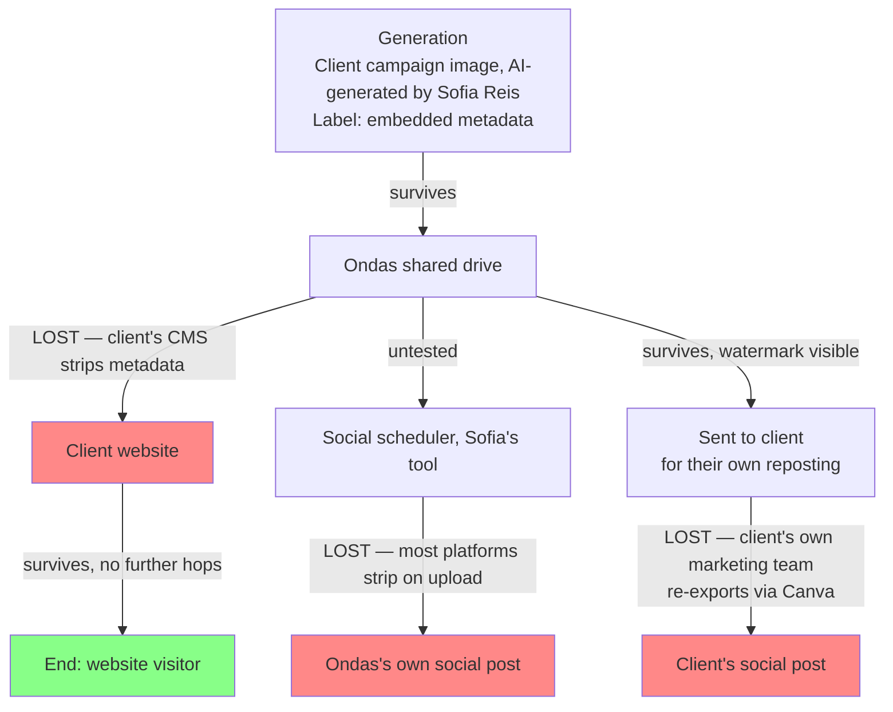

# Chapter 5: Building Your Own Label Chain of Custody

*Companion to "Every Hand That Touched It"*

The essay's argument was that a label attached once, at generation, is not the same claim as a label that survives to the point a viewer sees it. Screenshots, format conversions, and re-exports strip labels as a matter of routine, not malice. This chapter maps where that happens to your own content, before a regulator maps it for you.

## Worked example

| Hop | Label survives by default? | Responsible | Last tested |
|---|---|---|---|
| Generation → Shared drive | Yes (embedded metadata) | Sofia Reis | 22 Feb 2027 |
| Shared drive → Client's own website | **No** — client's CMS strips metadata on upload | Client's own web team, not Ondas | 22 Feb 2027 |
| Shared drive → Social scheduler | **Untested** | Sofia Reis | — |
| Shared drive → Client → Client's social post | **No** — client re-exports via their own tool, crops the watermark in the process | *unassigned* | — |

One diagram, four rows, and Sofia could already see what a linear checklist would have hidden: the same image forks three ways from a single point, and two of the three dead ends aren't even inside Ondas's own systems, they're inside the client's. The dead end with no name attached is the one worth acting on first, and in this case it required a conversation Ondas had never had with a client before: whose job is it to keep the label on an asset once we've handed it over.

## Building your own

**Map the hops.** Start at generation and follow every path your content actually takes, not the path your policy says it should take. Include the ones you're not proud of, the partner handoff nobody reviewed, the contractor's own tools.

**Test, don't assume.** A label surviving one hop is not evidence it survives the next. Each edge in the diagram gets its own answer: yes, no, or untested, and untested is the honest default until someone actually checks.

**Name a responsible party per hop, not per asset.** The person accountable for the label surviving the CMS upload is not automatically the person accountable for it surviving a partner's re-export. Different hop, different point of failure, different name.

## Who fills this in, and when

Filled jointly by whoever owns content generation and whoever owns each downstream distribution channel, redrawn whenever a new distribution path is added, a new partner, a new platform, a new re-posting workflow. A diagram drawn once at launch and never touched again will silently stop matching reality the first time marketing adds a channel nobody thought to loop back into this chapter.

The failure mode specific to this chapter: testing the easy hops and leaving the inconvenient ones marked "untested" indefinitely. An untested hop several steps removed from your own systems, the partner's re-export, the third-party scheduler, is usually the one most likely to be losing the label, precisely because it's furthest from anyone who'd notice.
